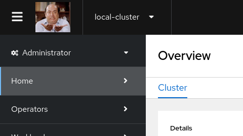
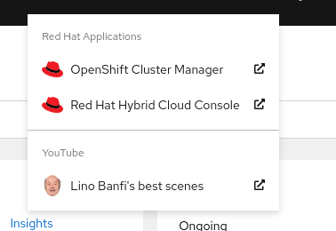

# LinoShift - an OpenShift web console customization honoring one of the best Italian's Actor

## Custom Logo

- Gif, Jpg, Png or SVG
- max-height = 60px

```
 oc create configmap console-custom-logo -n openshift-config --from-file=./images/logo.png
```

Add the custom logo to the web console:

```
apiVersion: operator.openshift.io/v1
kind: Console
metadata:
  name: cluster
spec:
  customization:
    customLogoFile:
      key: logo.png
      name: console-custom-logo
    customProductName: LinoShift Web Console
```

Result:




## Web console link

```
apiVersion: console.openshift.io/v1
kind: ConsoleLink
metadata:
  name: console-link
spec:
  href: 'https://www.youtube.com/watch?v=jW5wBHUQDMI'
  location: ApplicationMenu 
  text: Lino Banfi's best scenes
```

Result:



